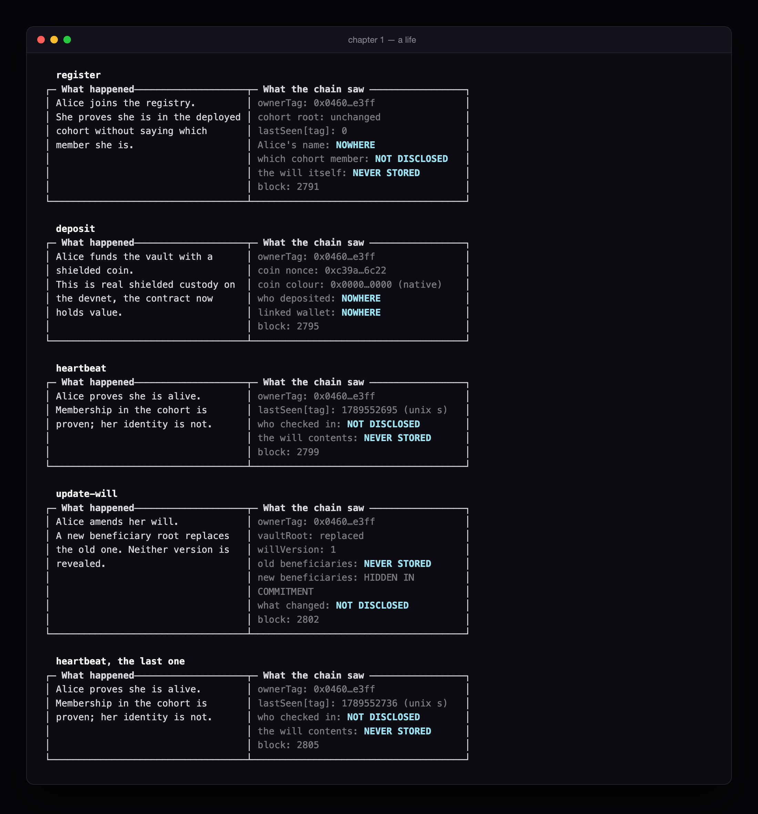
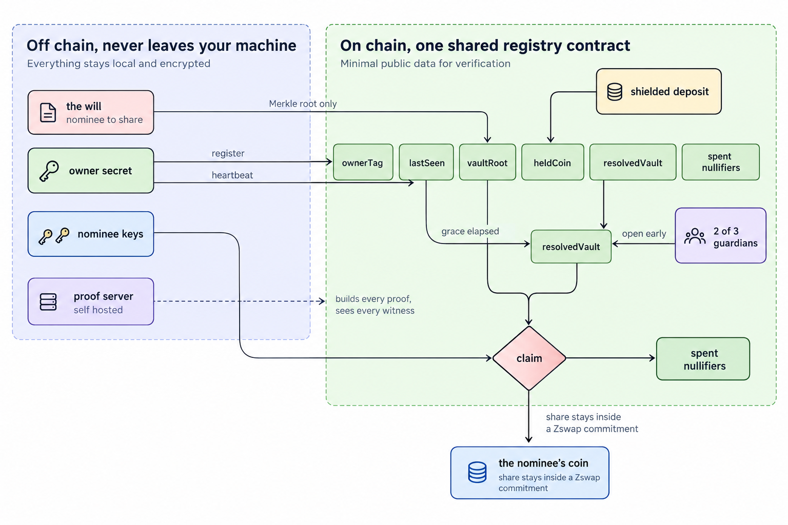
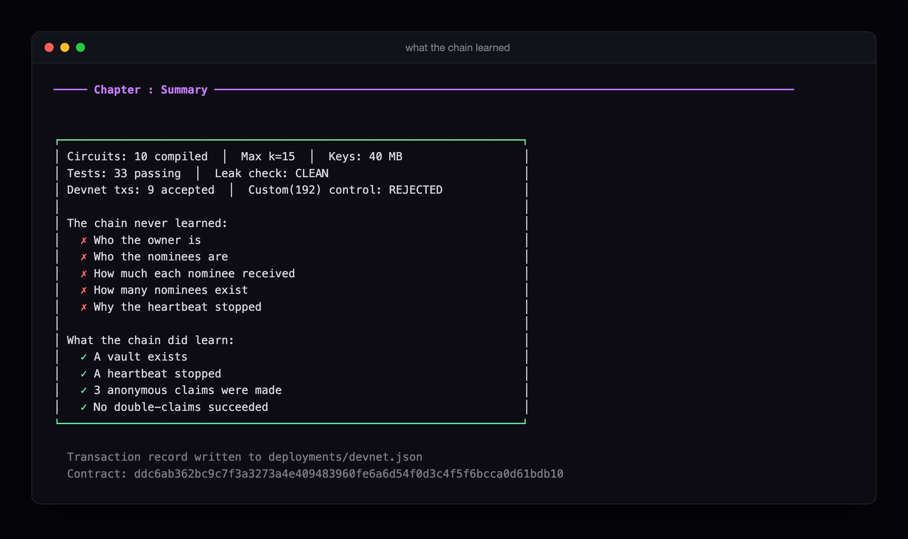
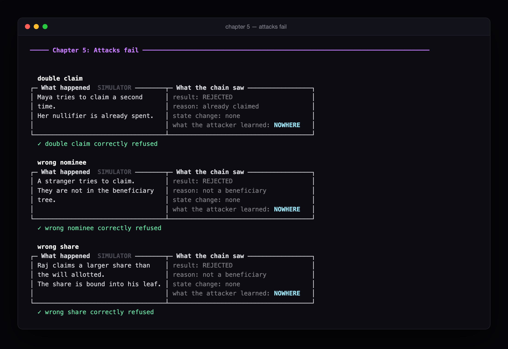

# Nominee
### Add a nominee to your crypto. Nobody learns who.
nominee.world · built on Midnight

---

**$68.7 billion in Bitcoin is permanently lost.** Much of it belonged to people who died. Their families got nothing, not because the money was stolen, but because every existing solution forces a choice: reveal your nominees to a company, expose them on a public chain, or accept that your crypto dies with you.

**Nominee** is a private, self-executing nominee registry on Midnight. You deposit assets, name your nominees, and check in with a periodic heartbeat. If the heartbeats stop, the vault unlocks and each nominee claims their share. Nobody, ever, learns who they are.

**Your crypto knows who comes next. Nobody else does.**

[Demo video](https://youtu.be/Fb69qNrujFU) · [Deck](docs/nominee-deck.pdf) · [nominee.world](https://nominee.world)



Every step of the demo prints two panels. What actually happened on the left,
what the chain got out of it on the right.

---

## Why Midnight

| | Reveals the beneficiary | Trusts a company |
|---|---|---|
| Sarcophagus | Yes, recipient address, resurrection time, every check-in | No |
| Bitcoin timelock / miniscript | Yes, at spend: script policy, timelock, heir pubkey | No |
| Casa Inheritance | No | **Yes** |
| Inheriti | No | **Yes** |
| Coinbase | Yes, to the company and the court | **Yes** |
| **Nominee** | **No** | **No** |

Every *trustless* option reveals the beneficiary, at setup, or at execution. Every option that hides the beneficiary trusts a company. Nominee is the only design where the beneficiary set, the per-nominee shares and the conditions are never public while execution stays trustless and on-chain.

That is only possible because of two Midnight properties together: a **shielded pool** that hides value, and a **compiler that statically proves** a private value never reaches public state.

## Run it

You need [Docker](https://docs.docker.com/desktop/) running and
[Bun](https://bun.sh). You do **not** need the Compact toolchain, the compiled
circuits and proving keys in `contract/out/` are committed.

```bash
git clone https://github.com/vwakesahu/nominee && cd nominee
bun install                   # always from the repo root, see the gotcha below
./run-devnet.sh               # brings up the devnet and runs the demo on chain
```

`run-devnet.sh` starts Docker Desktop if it is not up, brings up the node,
indexer and proof server, builds the CLI and runs the demo live. First run pulls
images and takes a few minutes. After that it is about six.

To run the pieces separately:

```bash
docker compose up -d            # node, indexer, proof server
bun run --cwd cli build
node cli/dist/index.js demo     # simulator, fast, no chain
NOMINEE_LIVE=1 node cli/dist/index.js demo   # real proofs on the devnet
```

Tests and checks:

```bash
bun run test        # 33 simulator tests
bun run leakcheck   # ZKIR privacy scan, checks no secret reaches public state
bun run nominee doctor
```

A recorded live run is in [`deployments/devnet.json`](deployments/devnet.json):
**9 accepted transactions**, deploy through `guardianResolve2of3`.

## Architecture

One **shared registry contract** serves many owners, a contract per will would turn every heartbeat into a per-person fingerprint.



Every arrow crossing into the contract carries a hash, a root or a proof. The
will, the identities and the individual shares never make that crossing.


Full detail (state layout, per-circuit inputs, envelope format, threat model) is in [`docs/ARCHITECTURE.md`](docs/ARCHITECTURE.md).

## What the chain learns




**Never:**
- Who the owner is
- Who the nominees are
- How much each nominee received
- How many nominees exist
- Why the heartbeat stopped

**Does:**
- A vault exists
- A heartbeat stopped
- N anonymous claims were made
- No double-claim succeeded

### Attacks, run every time the demo runs



## Honest limits

Named here because a judge will find them anyway, and because the validation found them first.

- **The proof server sees every witness. Self-host it, always.** This also rules out `getProvingProvider()` in the DApp Connector, which delegates proving to the wallet.
- **Deposit amounts are public**, the coin is a circuit argument, and circuit arguments are public.
- **The remaining balance is public** in `heldCoin`, so the outstanding total is observable even though individual shares are not.
- **Heartbeat cadence is a timing fingerprint.** The shared registry blunts it, an observer sees *someone* checked in, but it does not erase it.
- **A long hospital stay executes the will.** Guardians are safety-critical, not a nice-to-have.
- **Lace has no plugin mechanism**, Nominee is its own DApp that wallets connect to, not a wallet feature.
- **Legally this is a transfer mechanism, not a will.** Lead with the probate-disclosure feature, not the privacy feature.

## Two gotchas worth knowing

**Always install from the repo root.** Installing inside a workspace creates a
second copy of the wasm bindings there, which reproduces the class-identity
failure below. The root `overrides` pin only applies to a root install.

Bun is the package manager. The CLI is still executed with `node`, never with
bun or a TypeScript loader, for the reason below.

**Run the CLI on plain `node`, never through `tsx`.**

A transform-based TypeScript loader resolves the wasm bindings under a second
module URL, so two copies of `ContractState` end up in the process and every
`instanceof` check across the boundary fails:

```
'contractState' parameter ContractState (...) has unexpected type
expected instance of ContractMaintenanceAuthority
```

Measured directly, `cs instanceof ContractState` is `false` under `tsx` and
`true` under `node`. That is why `bin/nominee` compiles first and spawns
`node dist/index.js`, and why the same code passes 33 tests under vitest (which
keeps one instance) while failing under `tsx`.

## Roadmap

- **Wave 2**, live shielded payout, Preprod deployment, frontend
- **Wave 3**, probate disclosure, duress decoy, DAO successor-signer

## Validation trail

We verified every claim before building any of it. The evidence is in [`validation/`](validation/): three reports, five experiment harnesses and the raw data behind them, including the controlled experiment that proved shielded custody works and unshielded does not, and the one that resolved `blockTime` units to seconds.

Where something could not be verified, the reports say so and name exactly what would settle it.

## Licence

Apache-2.0. Repository topic: `midnightntwrk`.
